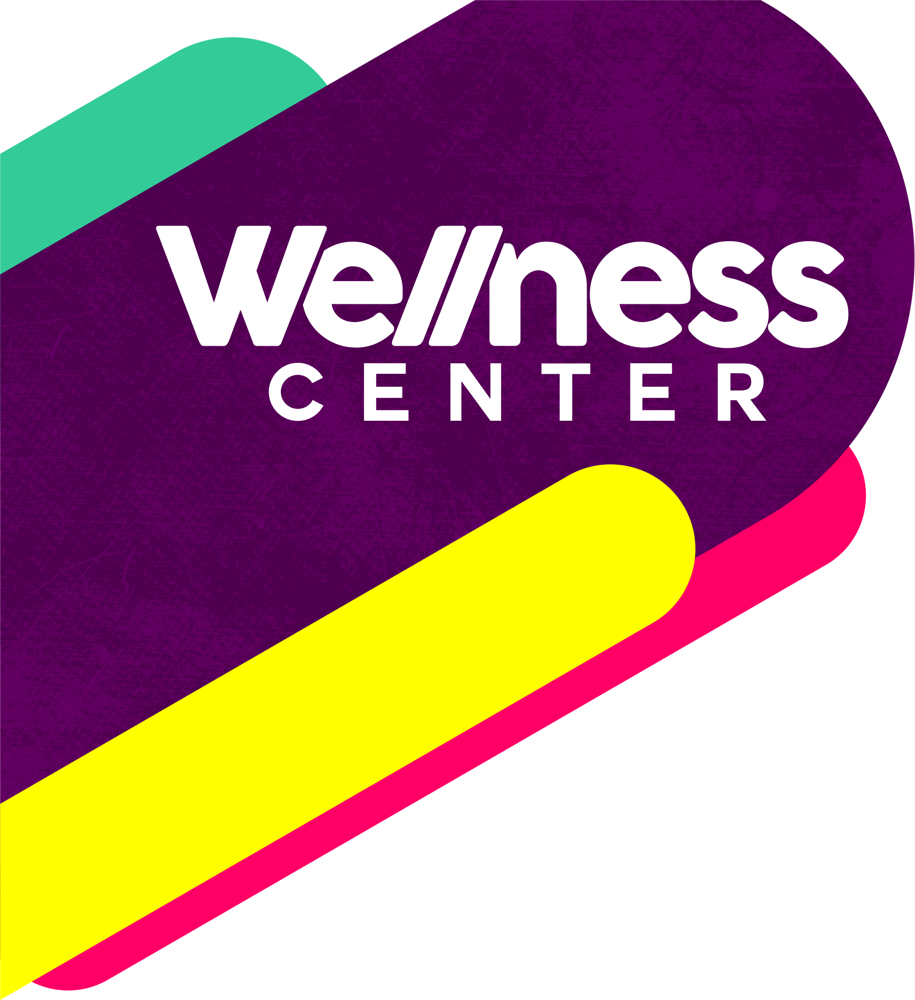
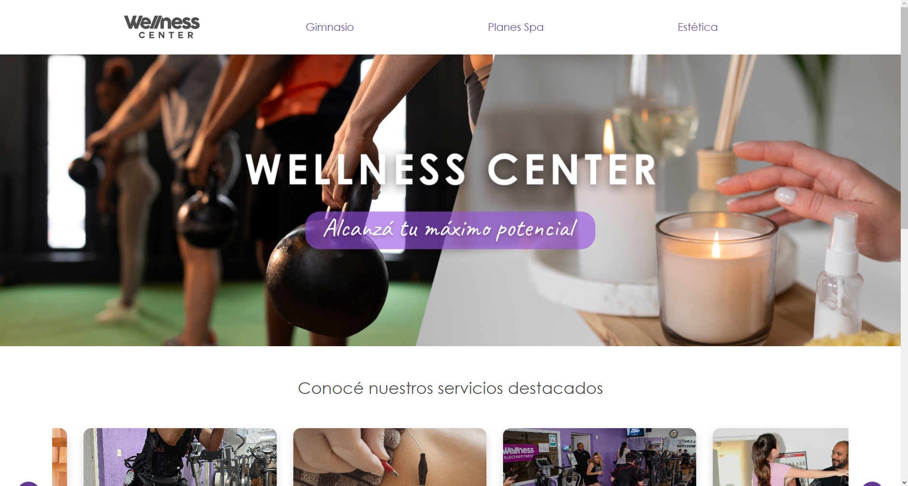

  <h1>💜Alcanzá tu máximo potencial💜</h1>

  
   
 
  

  

### ✨ ¡Bienvenido a nuestro sitio web dedicado al bienestar integral! En colaboración con un equipo de dos diseñadoras UX/UI y dos programadores en React. Hemos creado un sitio web personalizado para un cliente real. Nuestra plataforma se dedica a ofrecer una experiencia centrada a la salud física como mental.

 

## :hammer_and_wrench:	**Tech Stack:**

  

      &nbsp;
      &nbsp;
      &nbsp;
      
      
      &nbsp;
       
     

     

 

## :triangular_ruler: Prototipado

* [UI - UX](https://www.figma.com/file/URRP9K1hlCs9ZKJIhA2Y6A/Proyecto-Wellness-Center?type=design&node-id=7-37&mode=design&t=WaFl8dTwfMv2QTNv-0) Investigando al cliente.

* [UI - UX](https://www.figma.com/file/URRP9K1hlCs9ZKJIhA2Y6A/Proyecto-Wellness-Center?type=design&node-id=35-2&mode=design&t=WaFl8dTwfMv2QTNv-0) Prototipo de los Wireframe.

  

 
  

  

